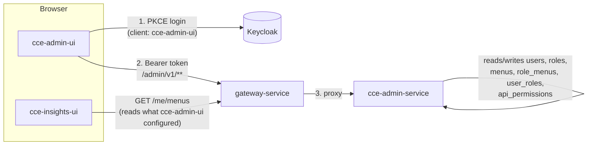

# Architecture Overview

## 1. Purpose

`cce-admin-ui` is the browser-based admin console for
[`cce-admin-service`](../../cce-admin-service/docs/architecture-overview.md). It gives a
platform administrator a UI over that service's REST API to:

- Create/manage the **users** who may sign in to `cce-insights-ui` (and future CCE
  consoles).
- Define **roles**, and curate which **menus** (screens) and which **API permissions**
  each role grants.
- **Assign roles to users.**

It renders forms and tables over `cce-admin-service`'s API; it holds no business rules
of its own about what a role/menu/permission *means* or how they're enforced — that
model is owned by the backend and documented there:

| Topic | Doc |
|---|---|
| Entity definitions (User, Role, Menu, Permission) | [cce-admin-service/architecture-overview.md §2](../../cce-admin-service/docs/architecture-overview.md#2-core-concepts) |
| Database schema | [cce-admin-service/data-dictionary.md](../../cce-admin-service/docs/data-dictionary.md) |
| AuthN/AuthZ rules, Keycloak provisioning split | [cce-admin-service/security-model.md](../../cce-admin-service/docs/security-model.md) |
| REST endpoint contracts this app calls | [cce-admin-service/api-reference.md](../../cce-admin-service/docs/api-reference.md) |
| Sequence diagrams for onboarding/role-config flows | [cce-admin-service/flow-diagrams.md](../../cce-admin-service/docs/flow-diagrams.md) |

This document covers only what's specific to the frontend: system context, this app's
own access-control model, technology stack, and code layout.

## 2. System Context



`cce-admin-ui` and `cce-insights-ui` are peers: both are Keycloak-authenticated SPAs
behind the same `gateway-service`, both call their respective backend only over REST.
Neither talks to a database or to Keycloak's admin API directly — see
[api-integration.md](api-integration.md) for how the Bearer token and base URL are
wired up, and [cce-admin-service/security-model.md §1](../../cce-admin-service/docs/security-model.md#1-actors-and-trust-boundary)
for the full trust-boundary picture.

## 3. This app's own access control

This is a decision specific to the frontend, not documented on the backend side, so it's
recorded here: `cce-admin-service`'s `menus` table is seeded from — and exists to
control — **`cce-insights-ui`'s** sidebar (see
[cce-admin-service/data-dictionary.md §3](../../cce-admin-service/docs/data-dictionary.md#3-menus)).
It is not extended to cover `cce-admin-ui`'s own screens, and `cce-admin-ui` does not
call `GET /me/menus` to decide its own navigation. Reasons:

- The `menus` seed list is explicitly the current `cce-insights-ui` navigation;
  overloading it with admin-console screens would mean two unrelated apps' navigation
  living in one table, with no way to tell which row belongs to which app.
- Admin-console screens are few, static, and change only when this app itself gains a
  feature — a checkbox-configurable menu tree (built for an analytics console with many
  optional screens) is unneeded complexity here.

Instead:

- `cce-admin-ui`'s sidebar is **static**, defined in the frontend code (see
  [pages-and-wireframes.md](pages-and-wireframes.md)).
- Actual authorization is enforced the same way as any other API caller's: `roles.name`
  must have `api_permissions` rows for the `/admin/v1/**` routes it calls (see
  [cce-admin-service/security-model.md §4](../../cce-admin-service/docs/security-model.md#4-one-identifier-role--realm-role--permission_name)).
  A user without those permissions can load the shell but every call fails with
  `403 FORBIDDEN`; the UI surfaces that as an inline error rather than pre-hiding nav
  items, since there is no `GET /me/menus`-equivalent for its own screens to hide them
  correctly ahead of time. If usage shows this is confusing, a `GET /me`-driven
  coarse show/hide (e.g. hide "Roles" entirely if the caller's roles have no
  `/admin/v1/roles**` permission) is a reasonable additive follow-up, not a redesign.
- `GET /me` (already in the backend's API) is used once after login to show the
  signed-in admin their own username/roles in the header — see
  [pages-and-wireframes.md](pages-and-wireframes.md).

## 4. Technology Stack

Same stack as `cce-insights-ui`, since both are Keycloak-authenticated React SPAs behind
the same gateway maintained by the same team — matching it means one shared mental
model, shared CI patterns, and no second toolchain to keep current. Deviations are
listed with why.

| Concern | Choice | vs. `cce-insights-ui` |
|---|---|---|
| Framework | React 18.x | Same |
| Language | TypeScript 5.x | Same |
| Build tool | Vite 6.x | Same |
| Routing | React Router 7.x | Same |
| Server state | TanStack Query 5.x | Same |
| Auth | `keycloak-js` 26.x, Authorization Code + PKCE | Same library/flow; separate Keycloak **client id** `cce-admin-ui` (own redirect URIs, distinct from `cce-insights-ui`'s client) — see [api-integration.md](api-integration.md) |
| HTTP client | Native `fetch`, typed wrapper | Same pattern (`api/client.ts`), pointed at `cce-admin-service`'s `/admin/v1` base path instead of the insights service — see [api-integration.md](api-integration.md) |
| Styling | Tailwind CSS 4.x | Same |
| Icons | Heroicons 2.x | Same |
| Date utilities | date-fns 4.x | Same |
| Data tables | **TanStack Table 8.x** | *Addition.* `cce-insights-ui` has no equivalent — this app is primarily list/edit screens (users, roles, permission rules), and TanStack Table pairs with the TanStack Query data already being fetched rather than hand-rolling sortable/paginated tables |
| Forms & validation | **React Hook Form 7.x + Zod 3.x** | *Addition.* `cce-insights-ui` is read-only and has no forms; this app is almost entirely forms (create/edit user, role, menu, permission rule) |
| Charts | *Not used* | `cce-insights-ui` uses Recharts for analytics visuals; this app has no charts to render |
| Testing | Vitest + Testing Library + MSW | Same |
| Containerization | Docker, multi-stage: `node:20-alpine` build → `caddy:2-alpine` runtime | Same — see [deployment-guide.md](deployment-guide.md) |
| Package manager | npm 10+ | Same |

## 5. Internal Layering

```
src/
  pages/         # Route-level components: Users, UserDetail, Roles, RoleDetail, Menus, (compose hooks + components, no direct fetch calls)
  components/    # Stateless/shared UI: DataTable, forms, modals, sidebar shell
  hooks/         # TanStack Query wrappers per resource (useUsers, useRoles, useRoleMenus, useRolePermissions, useMenus)
  api/           # Typed fetch wrappers, one module per cce-admin-service resource (users.ts, roles.ts, menus.ts, me.ts)
  auth/          # keycloak-js init, token accessor, auth context
  schemas/       # Zod schemas for form validation, shared with the api/ layer's response types where they overlap
  context/       # Cross-page state (e.g. currently signed-in admin, from GET /me)
```

Mirrors `cce-insights-ui`'s `pages / components / hooks / api` split (see its
[architecture-overview.md](https://github.com/openphc/cce-insights-ui/blob/demo-rw/docs/architecture-overview.md)),
with `auth/` and `schemas/` broken out because this app's pages are mutation-heavy
(forms with validation) where `cce-insights-ui`'s are read-only.

## 6. Non-Functional Notes

- **Optimistic UI is not used.** Every mutation (create user, update role menus,
  update role permissions) waits for the backend response before updating local state —
  `cce-admin-service`'s writes fan out to Keycloak and, for permissions, to
  `gateway-service`'s sync endpoint (see
  [cce-admin-service/flow-diagrams.md](../../cce-admin-service/docs/flow-diagrams.md)),
  so a write can fail after starting; showing an optimistic success and then rolling
  back is worse UX here than a brief wait.
- **`502 KEYCLOAK_SYNC_FAILED` gets a distinct, non-generic error state** in forms that
  can trigger it (user creation, role permission updates) rather than being folded into
  a generic "something went wrong" toast, since the backend's own docs call out that
  this leaves state partially applied and may need manual reconciliation — see
  [cce-admin-service/api-reference.md](../../cce-admin-service/docs/api-reference.md#common-error-codes).
- **No client-side audit trail.** `audit_log` is written and owned entirely by
  `cce-admin-service`; this app has no screen for it in v1 because the backend does not
  yet expose a read endpoint for it (see
  [cce-admin-service/api-reference.md](../../cce-admin-service/docs/api-reference.md)) —
  adding one is a backend change, tracked there, not here.
- **Pagination**: list screens (Users) follow the backend's `page`/`pageSize` contract
  directly — see [cce-admin-service/api-reference.md §Pagination](../../cce-admin-service/docs/api-reference.md#pagination).

## 7. Deployment Summary

See [deployment-guide.md](deployment-guide.md) for the full detail. In short: Docker
multi-stage build, Caddy-served static SPA, reverse-proxied to `gateway-service` in the
same pattern `cce-insights-ui` uses, on its own port so both consoles can run side by
side.
